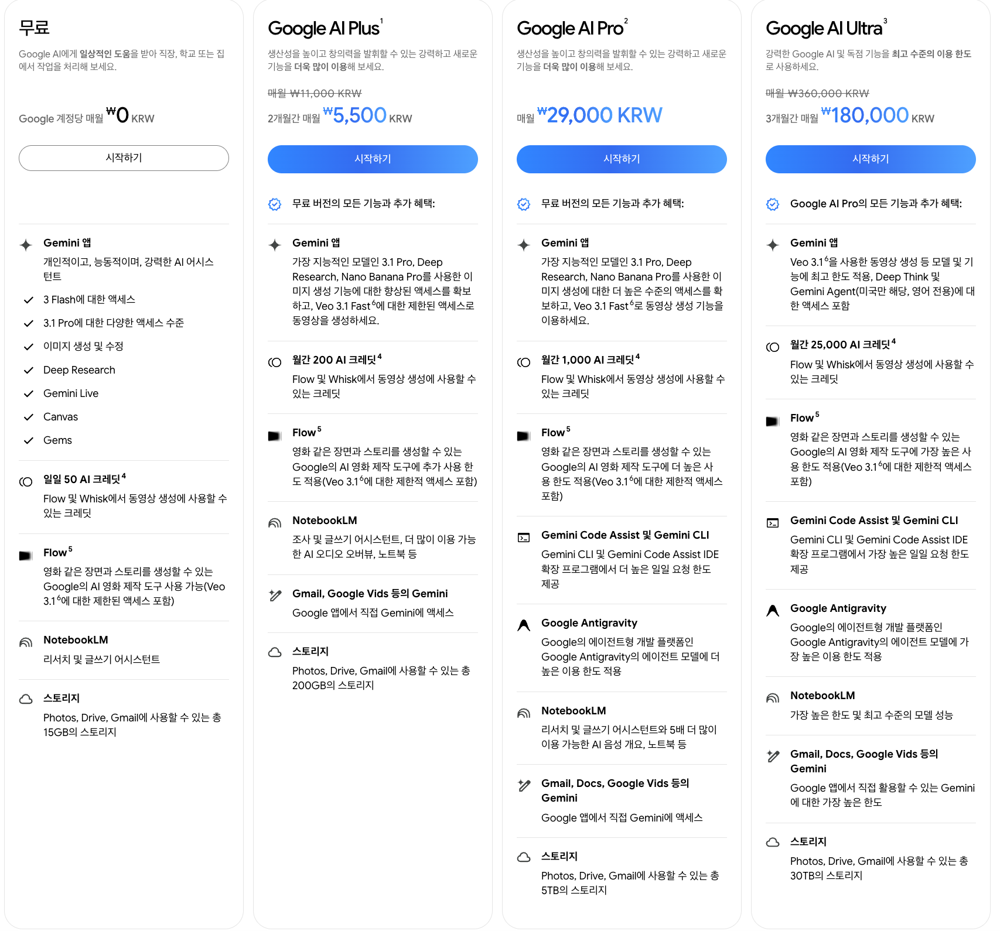
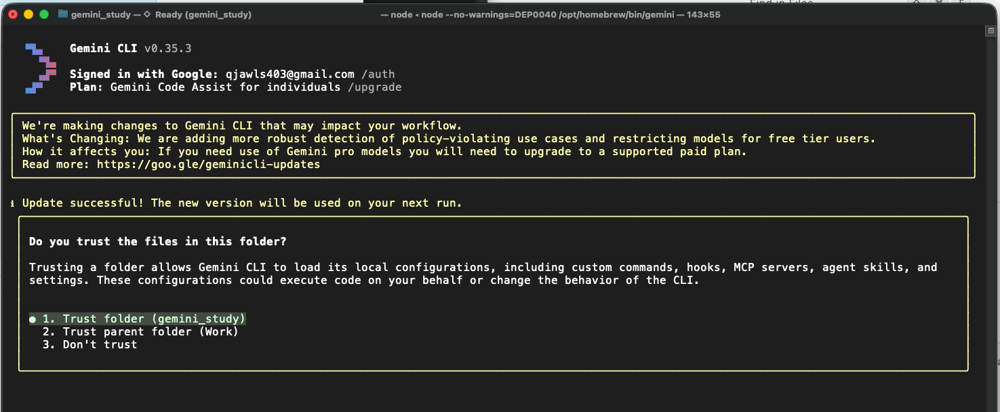
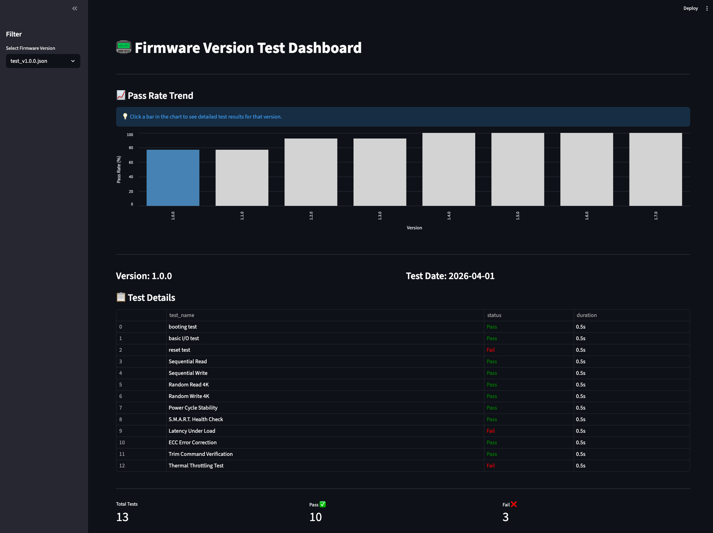
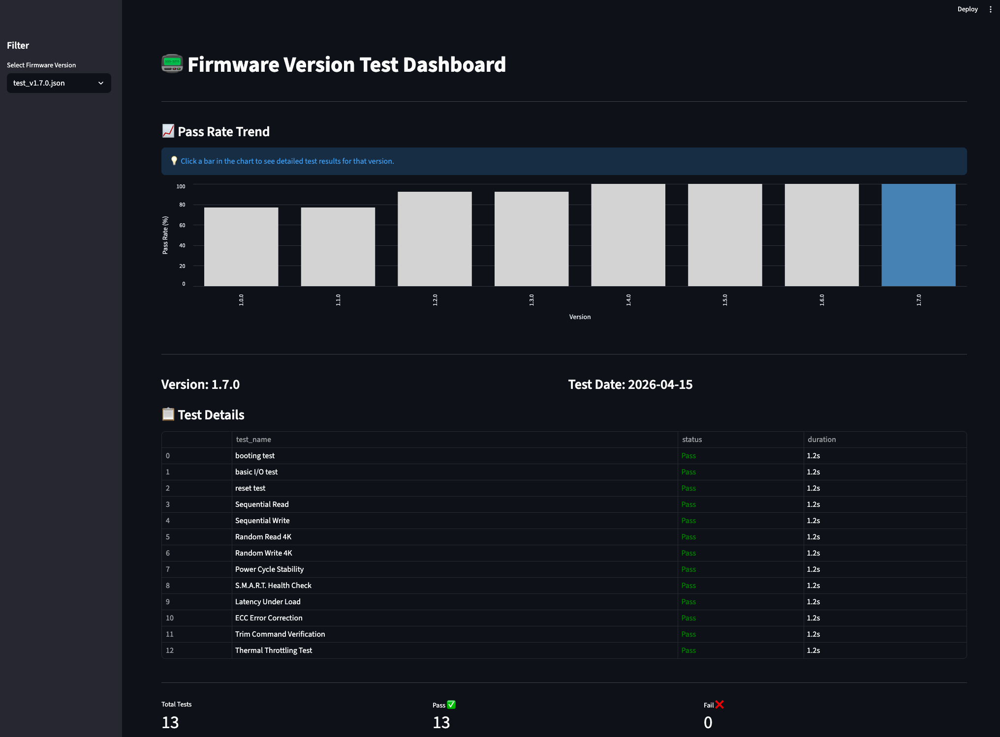
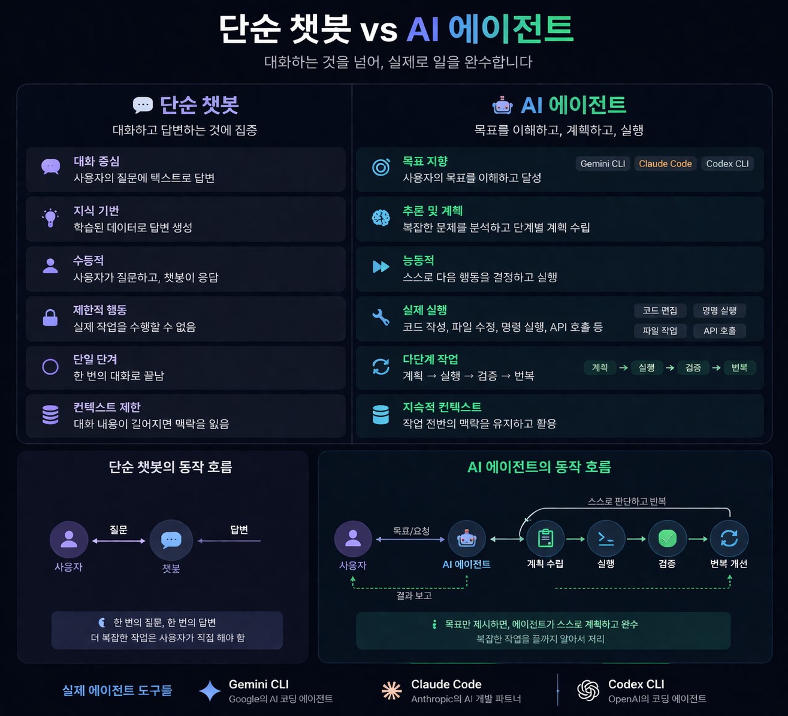

# Gemini CLI · NotebookLM 소개 및 활용 가이드

## 목차
- [1. Gemini CLI란?](#1-gemini-cli란)
- [2. 주요 특징](#2-주요-특징)
- [3. Gemini 요금제 안내](#3-gemini-요금제-안내)
- [4. Gemini CLI 초기 화면](#4-gemini-cli-초기-화면)
- [5. 실무 활용 예시 (Example 1)](#5-실무-활용-예시-example-1)
- [6. 실무 활용 예시 (Example 2)](#6-실무-활용-예시-example-2)
- [7. 실무 활용 예시 (Example 3)](#7-실무-활용-예시-example-3)
- [8. Coding Agent 핵심 포인트](#8-coding-agent-핵심-포인트)
- [9. NotebookLM 소개](#9-notebooklm-소개)
- [10. 여담](#10-여담)

이 문서는 **Gemini CLI**와 **NotebookLM**을 팀 실무 관점에서 소개하고 활용 방법을 정리한 가이드입니다.

## 1. Gemini CLI란?
Gemini CLI는 터미널 환경에서 직접 Gemini AI의 강력한 기능을 활용할 수 있게 해주는 도구입니다. 코드 분석, 버그 수정, 테스트 코드 생성 등 개발 전 과정에서 AI 페어 프로그래머 역할을 수행합니다.

## 2. 주요 특징
- **코드베이스 이해**: 프로젝트 전체 구조와 의존성을 파악하여 질문에 답변합니다.
- **자동화된 작업**: 파일 수정, 쉘 명령 실행, 테스트 수행 등을 자율적으로 진행합니다.
- **다양한 스킬**: `skill-creator` 등을 통해 특정 작업에 최적화된 기능을 확장할 수 있습니다.

## 3. Gemini 요금제 안내
Gemini CLI는 사용자의 요구사항과 프로젝트 규모에 맞는 다양한 요금제를 제공합니다. 특히 **Gemini Code Assist** 기능에서의 차이점을 이해하는 것이 중요합니다.

| 구분 | Individuals (무료) | Standard / Enterprise (Pro) |
| :--- | :--- | :--- |
| **기본 기능** | AI 코드 완성, IDE 내 채팅, 코드 생성 | 무료 버전의 모든 기능 포함 |
| **사용량 한도** | 코드 완성: 일 6,000회 / 채팅: 일 240회 | **무제한에 가까운 높은 한도** 제공 |
| **컨텍스트 창** | 100만(1M) 토큰 로컬 인식 | **100만(1M) 토큰 + 대규모 조직 최적화** |
| **보안 및 규정** | 개인 계정 기준 보안 | **기업용 보안, 데이터 거버넌스, 지식재산권 보상** |
| **저장소 커스텀** | 로컬 파일 기반 인식 | **GitHub, GitLab 등 원격 저장소 전체 인덱싱** |
| **적용 모델** | **Gemini 3 Flash** (속도/효율성) | **Gemini 3.1 Pro / Ultra** (고급 추론) |
| **추가 혜택** | 기본 모델 활용 | **최신 모델 우선 접근, 전용 CLI 확장** |

- **무료 플랜 (Gemini 3 Flash)**: 응답 속도가 매우 빠르고 가벼운 작업에 최적화되어 있어, 간단한 코드 수정이나 빠른 질의응답에 유리합니다.
- **Google AI Pro (Gemini 3.1 Pro/Ultra)**: 더 깊은 추론 능력을 갖추고 있어 복잡한 시스템 아키텍처 설계, 대규모 리팩토링, 고도로 얽힌 버그 분석 등 정교한 작업에서 월등한 성능을 발휘합니다.



## 4. Gemini CLI 초기 화면
아래는 Gemini CLI를 실행했을 때 나타나는 초기 화면입니다. 프로젝트의 컨텍스트를 분석하고 사용자의 명령을 기다리는 상태를 보여줍니다.



## 5. 실무 활용 예시 (Example 1)
### 📟 Firmware Test Dashboard: Agentic Workflow 데모
단순한 코드 생성을 넘어, **프로젝트의 전체 생명주기를 자율적으로 관리**하는 Gemini CLI의 '에이전트' 능력을 보여주는 예시입니다.

#### 🛠️ 전 과정 자율 수행 (End-to-End Agentic Process)
이 대시보드는 개발자의 개별 코드 작성 없이, 오직 Gemini CLI와의 대화와 명령(Directive)만으로 구축되었습니다:

1.  **환경 구축 (Environment Setup)**:
    - `example1` 디렉토리 생성 및 가상 환경(`venv`) 구성
    - `Streamlit`, `Pandas`, `Altair` 등 필요한 라이브러리 자동 설치 및 관리
2.  **데이터 생성 (Automated Data Generation)**:
    - SSD 테스트 항목(Sequential Read/Write, S.M.A.R.T. 등) 13개를 포함한 JSON 데이터셋 8개 버전 자율 생성
3.  **반복적 개발 및 디버깅 (Iterative Dev & Debug)**:
    - **문제 해결**: 파일 경로 오류(`FileNotFoundError`) 발생 시, 스스로 원인을 분석하고 `os.path` 기반의 상대 경로 코드로 즉각 수정
    - **기능 고도화**: 단순 표 출력을 넘어, 차트 클릭 시 상세 내용이 연동되는 복잡한 '양방향 동기화(Bidirectional Sync)' 로직을 설계 및 구현
4.  **릴리스 및 관리 (Release & Git Management)**:
    - 개발된 모든 코드와 데이터를 Git 저장소에 스테이징, 커밋 메시지 작성, 원격 저장소 푸시까지 일괄 수행
    - 백그라운드 프로세스 관리(App 실행 및 종료) 제어

> **핵심 가치**: 개발자는 "어떤 기능을 만들까?"라는 의도만 전달하고, **"어떻게 구현하고 환경을 잡을까?"**에 대한 모든 기술적 복잡도는 에이전트가 해결합니다.

#### 실행 화면 (Example 1)



## 6. 실무 활용 예시 (Example 2)
### 🧪 Custom Skill: Sensor Test Expert 활용
Gemini CLI의 기능을 특정 도메인에 특화시키는 **'Skill(스킬)'** 시스템의 실제 구현 예시입니다.

#### 📁 구성 요소
- `example2/processor.py`: 센서 데이터 처리 핵심 로직
- `example2/skill.md`: **[핵심]** 전문가 페르소나와 테스트 규칙이 정의된 스킬 파일
- `example2/test_processor.py`: 스킬을 통해 생성된 고품질 테스트 코드

#### 🔄 Skill 적용 전 vs 후 (코드 비교)

1. **대상 로직 (`example2/processor.py`)**
```python
def process_sensor_data(data):
    if not isinstance(data, list):
        raise ValueError("입력값은 리스트여야 합니다.")
    valid_readings = [r for r in data if isinstance(r, (int, float)) and 0 <= r <= 100]
    if not valid_readings:
        raise ValueError("유효한 센서 데이터(0-100)가 없습니다.")
    return sum(valid_readings) / len(valid_readings)
```

2. **Skill 적용 전 (일반 모드)**: 기본적인 성공/실패 케이스만 검증
```python
def test_basic_average():
    assert process_sensor_data([10, 20, 30]) == 20.0

def test_empty_list():
    with pytest.raises(ValueError):
        process_sensor_data([])

def test_single_value():
    assert process_sensor_data([50]) == 50.0
```

3. **Skill 적용 후 (Sensor Test Expert)**: 경계값, 타입 혼합 등 실무 시나리오 완벽 커버
```python
# 2. Boundary Values (경계값 케이스: 0과 100)
def test_process_boundary_values():
    data = [0, 50, 100]
    assert process_sensor_data(data) == 50.0

# 3. Mixed Types (유효하지 않은 데이터가 섞인 경우)
def test_process_mixed_data_types():
    data = ["error", None, -10, 110, 50]
    assert process_sensor_data(data) == 50.0

# 5. Exception: No valid data (유효한 데이터가 없는 경우)
def test_no_valid_data():
    with pytest.raises(ValueError, match="유효한 센서 데이터"):
        process_sensor_data([-1, 101, "invalid"])
```

> **핵심 가치**: "팀의 노하우가 담긴 `SKILL.md`를 자산화함으로써, 주니어 개발자도 시니어 수준의 검증 환경을 즉시 구축할 수 있습니다."

## 7. 실무 활용 예시 (Example 3)
### 🔁 Self-Correction Loop: HW 테스트 펌웨어 자동 수정 데모
실행 중 실패하는 펌웨어 테스트 코드를 기반으로, 에이전트가 오류 로그를 해석하고 반복 수정하는 흐름을 보여주는 예시입니다.

#### 🎯 시나리오 목표
- I2C 주소, 문법(`self` 누락), 비트 연산, 타입 불일치 같은 복합 오류를 순차적으로 검출
- 각 실패 원인에 대해 수정안을 적용하고 재실행하여 최종 PASS 상태까지 수렴
- 수정 결과를 코드 + 재현 가능한 테스트 절차로 남겨 재발을 방지

#### 🧪 Example 3 테스트 코드
<details>
  <summary><code>example3/test_firmware1.py</code> 펼치기</summary>

```python
import time
import random

# [가상 HW 환경 모사] - 실제 HW가 없으므로 클래스로 모사합니다.
class VirtualI2CDevice:
    def __init__(self, address):
        self.address = address
        self.registers = {
            0x00: 0x1A, # 온도 데이터 High Byte
            0x01: 0x4B, # 온도 데이터 Low Byte (정상 범위)
            0x02: 0x01  # Config Register
        }

    def read_byte(self, reg):
        if reg not in self.registers:
            raise RuntimeError(f"Error: Invalid Register Access 0x{reg:02X}")
        return self.registers[reg]

# ---------------------------------------------------------
# [버그가 포함된 HW 테스트 펌웨어 코드]
# ---------------------------------------------------------

class SensorTester:
    def __init__(self):
        # 버그 1: 잘못된 I2C 주소 (실제 장치는 0x48이어야 함)
        self.sensor_addr = 0x99
        self.device = VirtualI2CDevice(self.sensor_addr)
        self.threshold = 30.0

    def get_temperature(self):
        # 버그 2: 'self' 누락 (파이썬 기본 문법 에러)
        high_byte = device.read_byte(0x00)
        low_byte = self.device.read_byte(0x01)

        # 버그 3: 잘못된 비트 연산 논리 (온도 변환 공식 오류)
        # 실제 공식: (High << 4) | (Low >> 4) 인데 실수로 작성됨
        raw_temp = (high_byte << 8) + low_byte
        temp_c = raw_temp * 0.0625
        return temp_c

    def run_test(self):
        print(f"--- Starting HW Test at Address {hex(self.sensor_addr)} ---")

        # 버그 4: 타입 불일치 (문자열과 숫자 비교)
        current_temp = "26.5"
        current_temp = self.get_temperature()

        print(f"Current Temperature: {current_temp} C")

        if current_temp > self.threshold:
            print("[RESULT] Status: FAIL - Overheated!")
            return False
        else:
            print("[RESULT] Status: PASS")
            return True

if __name__ == "__main__":
    tester = SensorTester()
    success = tester.run_test()
    if not success:
        exit(1) # 에러 상태로 종료
```

</details>

#### ▶ 기존 테스트코드 실행 결과
실행 명령: `python3 example3/test_firmware1.py`

```text
--- Starting HW Test at Address 0x99 ---
Traceback (most recent call last):
  ...
NameError: name 'device' is not defined
```

#### 🛠️ 디버깅 과정 (Self-Correction Loop)
1. `NameError` 로그를 기준으로 `get_temperature()`의 `device.read_byte(...)` 호출에서 `self` 누락을 식별
2. I2C 주소 하드코딩 오류(`0x99`)를 실제 주소(`0x48`)로 수정하고, 장치 주소 검증 로직 추가
3. 온도 변환식을 `(high << 8) + low`에서 12-bit 공식 `(high << 4) | (low >> 4)`로 수정
4. `run_test()`의 문자열 임시값 제거로 타입 혼선 제거
5. 수정본 재실행으로 최종 `PASS` 확인

#### ✅ 수정된 테스트코드
<details>
  <summary><code>example3/test_firmware1_fixed.py</code> 펼치기</summary>

```python
class VirtualI2CDevice:
    def __init__(self, address):
        if address != 0x48:
            raise RuntimeError(
                f"Error: Device not found at I2C address 0x{address:02X}"
            )
        self.address = address
        self.registers = {
            0x00: 0x1A,  # Temperature High Byte
            0x01: 0x4B,  # Temperature Low Byte
            0x02: 0x01,  # Config Register
        }

    def read_byte(self, reg):
        if reg not in self.registers:
            raise RuntimeError(f"Error: Invalid Register Access 0x{reg:02X}")
        return self.registers[reg]


class SensorTester:
    def __init__(self):
        self.sensor_addr = 0x48
        self.device = VirtualI2CDevice(self.sensor_addr)
        self.threshold = 30.0

    def get_temperature(self):
        high_byte = self.device.read_byte(0x00)
        low_byte = self.device.read_byte(0x01)

        # TMP102 style 12-bit conversion: (High << 4) | (Low >> 4)
        raw_temp = (high_byte << 4) | (low_byte >> 4)
        temp_c = raw_temp * 0.0625
        return temp_c

    def run_test(self):
        print(f"--- Starting HW Test at Address {hex(self.sensor_addr)} ---")

        current_temp = self.get_temperature()
        print(f"Current Temperature: {current_temp} C")

        if current_temp > self.threshold:
            print("[RESULT] Status: FAIL - Overheated!")
            return False

        print("[RESULT] Status: PASS")
        return True


if __name__ == "__main__":
    tester = SensorTester()
    success = tester.run_test()
    if not success:
        raise SystemExit(1)
```

</details>

#### ▶ 수정된 테스트코드 실행 결과
실행 명령: `python3 example3/test_firmware1_fixed.py`

```text
--- Starting HW Test at Address 0x48 ---
Current Temperature: 26.25 C
[RESULT] Status: PASS
```

> **핵심 가치**: 단일 버그 수정이 아니라, 실패 원인 분석 → 수정 → 재검증을 반복해 **실행 가능한 안정 상태**를 만드는 것이 Self-Correction Loop의 실무 가치입니다.

## 8. Coding Agent 핵심 포인트
Coding Agent(Gemini CLI)의 주요 가치와 이를 활용하여 개발자가 나아가야 할 발전 방향입니다.

### 1) 챗봇을 넘어선 '에이전트' (Action over Suggestion)
단순히 코드를 제안하는 것을 넘어, 직접 파일을 수정하고 터미널 명령을 실행하며 테스트까지 수행하는 자율성을 가집니다.
*   **발전 방향**: 에이전트에게 단순 기능을 요청하기보다는, 프로젝트 전반의 작업 흐름과 의도(Intent)를 명확히 정의하는 '설계적 사고' 역량을 키워야 합니다.

### 2) 전체 코드베이스의 깊은 이해 (Project-wide Context)
일일이 코드를 복사해 붙여넣을 필요 없이, 프로젝트 전체 구조와 파일 간의 의존성을 스스로 파악하여 정확한 컨텍스트 내에서 작업합니다.
*   **발전 방향**: 에이전트가 코드베이스를 명확히 이해하도록 명명 규칙을 통일하고, 구조적인 코드와 문서화를 유지하여 에이전트의 '인지 효율'을 높여야 합니다.

### 3) 팀 표준 및 규칙 준수 (Rule Enforcement)
`GEMINI.md`와 같은 설정 파일을 통해 팀의 코딩 컨벤션, 커밋 스타일, 라이브러리 활용 규칙을 완벽하게 준수하며 일관된 결과물을 생산합니다.
*   **발전 방향**: 팀의 기술적 자산과 노하우를 스킬(Skill)과 설정 파일에 체계적으로 기록하여, 우리 팀만의 고도화된 'AI 개발 파이프라인'을 구축해야 합니다.

### 4) 자가 수정 루프 (Self-Correction Loop)
구현 중 에러가 발생하면 로그를 분석하여 원인을 파악하고, 성공할 때까지 스스로 수정 및 재시도를 반복하여 완성도 높은 코드를 제공합니다.
*   **실무 활용 예시**: `Example 3`처럼 펌웨어 테스트 코드의 복합 오류를 단계적으로 해결하며 최종 PASS 상태까지 자동 수렴할 수 있습니다.
*   **발전 방향**: 에이전트의 시행착오를 모니터링하여 공통적인 오류 패턴을 파악하고, 이를 방지하는 테스트 코드를 선제적으로 작성하는 '방어적 개발' 습관을 길러야 합니다.

### 5) High-level 설계에 집중하는 생산성
반복적이고 지루한 Boilerplate 코드 작성을 AI에게 맡기고, 개발자는 비즈니스 로직과 시스템 설계 등 더 중요한 고수준 의사결정에 집중할 수 있습니다.
*   **발전 방향**: 코드 작성 자체보다는 소프트웨어 아키텍처, 도메인 모델링, 그리고 사용자 경험(UX) 관점의 의사결정에 더 많은 시간과 에너지를 투자해야 합니다.

## 9. NotebookLM 소개
NotebookLM은 문서, PDF, 노트, 회의록 등 팀의 지식 소스를 기반으로 답변과 요약을 생성하는 리서치/학습 보조 도구입니다. 외부 일반 지식보다 업로드한 내부 자료를 중심으로 답변한다는 점이 핵심입니다.

### NotebookLM 화면 예시


## 10. 여담
<details>
  <summary>chatGPT</summary>



</details>

<details>
  <summary>claude</summary>

[claude.html 열기](./fun/claude.html)

</details>

<details>
  <summary>gemini</summary>


</details>
